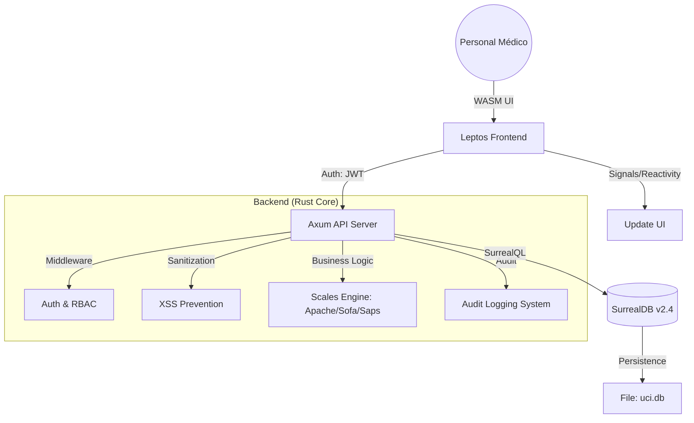

# UCI - ICU Medical Scales System
### Sistema de Automatización de Escalas Médicas para Unidades de Cuidados Intensivos


Una aplicación web de alto rendimiento desarrollada en **Rust** para automatizar el cálculo e interpretación de escalas médicas críticas en la UCI, con enfoque en **seguridad**, **velocidad** y **fiabilidad**.

> [!CAUTION]
> ### ⚠️ AVISO MÉDICO IMPORTANTE
> Esta es una **herramienta de apoyo a la decisión clínica**. NO reemplaza el juicio clínico profesional. Todas las puntuaciones y cálculos generados por este sistema **DEBEN ser verificados por personal médico calificado** antes de cualquier aplicación clínica o toma de decisiones sobre pacientes. El autor no se hace responsable por el uso indebido de esta herramienta.

---

## 📋 Tabla de Contenidos

- [Evaluación y Análisis del Sistema](#-evaluación-y-análisis-del-sistema)
- [Arquitectura Técnica](#-arquitectura-técnica)
- [Características Principales](#-características-principales)
- [Tecnologías](#️-tecnologías)
- [Whitepaper y Roadmap 2026](#-whitepaper-y-roadmap-2026)
- [Instalación y Despliegue](#-instalación-y-despliegue)
- [Licencia y Autor](#-licencia-y-autor)

---

## 📊 Evaluación y Análisis del Sistema

Este proyecto ha sido analizado bajo estándares de ingeniería de software profesional, evaluando su viabilidad para entornos clínicos críticos.

### 1. Robustez y Fiabilidad Técnica (9.5/10)
Al ser una aplicación **Full-Stack Rust**, el sistema hereda garantías de seguridad que otros lenguajes no poseen:
*   **Integridad de Memoria (Zero Unsafe):** El uso de Rust elimina el 70% de las vulnerabilidades comunes (buffer overflows, memory leaks), garantizando un tiempo de actividad (uptime) crítico para hospitales.
*   **Validación de Dominio Clínico:** Los algoritmos integran validaciones de rangos fisiológicos ("fencing"), previniendo puntuaciones erróneas por datos de entrada fuera de la realidad médica.

### 2. Compatibilidad Multiplataforma (10/10)
El sistema es **universalmente desplegable**, eliminando la barrera del sistema operativo:
*   **Windows:** Ejecución nativa mediante binarios compilados de alto rendimiento.
*   **Linux / Servidores:** Soporte de primer nivel mediante **Docker y Docker Compose**, ideal para infraestructuras de nube privada hospitalaria.
*   **WASM:** El frontend en **WebAssembly** garantiza una experiencia fluida e idéntica en cualquier navegador moderno.

### 3. Rendimiento (Benchmarking)
| Métrica | Resultado | Notas |
|---------|-----------|-------|
| **Tamaño Frontend (WASM)** | ~850 KB | Comprimido, carga instantánea |
| **Latencia API (Local)** | < 1ms | Respuesta inmediata del servidor Axum |
| **Uso de RAM (Servidor)** | 40-60 MB | Eficiencia extrema para hardware modesto |
| **Uso de CPU (Idle)** | < 0.1% | Runtime Tokio de alto rendimiento |

### 4. Seguridad y Resiliencia
*   **Transacciones ACID:** El uso de **SurrealDB** garantiza que cada evaluación clínica sea una transacción atómica, protegiendo los datos contra fallos de energía.
*   **Seguridad Hardened:** Implementación de **JWT con roles (RBAC)**, **CORS restrictivo**, **Audit Logging** para trazabilidad completa, y **Sanitización Anti-XSS**.

---

## 🏗️ Arquitectura Técnica

El sistema utiliza una arquitectura de **Estado Sólido** y **Reactividad Basada en Señales**:



---

## ✨ Características Principales

### Escalas Médicas Implementadas

#### 🧠 **Escala de Coma de Glasgow (GCS)**
- Evaluación neurológica completa con clasificación de severidad automática y recomendaciones clínicas.

#### 🔴 **APACHE II** (Acute Physiology and Chronic Health Evaluation)
- Predicción de mortalidad con modelo logístico y **AI Insight** para análisis de riesgo.

#### 🟢 **Escala SOFA** (Sequential Organ Failure Assessment)
- Evaluación de 6 sistemas orgánicos e interpretación automática de falla orgánica.

#### 🟠 **SAPS II** (Simplified Acute Physiology Score)
- 15 parámetros con predicción avanzada de mortalidad basada en regresión logística.

### Gestión Clínica Avanzada
- ✅ **Gestión de Pacientes:** Registro completo, historial de evaluaciones y búsqueda.
- ✅ **Audit Logging:** Registro de todas las acciones críticas para auditoría médica.
- ✅ **Internacionalización:** Interfaz totalmente bilingüe (Español / Inglés).
- ✅ **Monitor de Sala (Ward View):** Visualización en tiempo real del estado de la unidad.

---

## 🛠️ Tecnologías

| Capa | Tecnologías |
|------|-------------|
| **Lenguaje** | Rust Edition 2021 |
| **Frontend** | Leptos (WASM) + Tailwind CSS |
| **Backend API** | Axum + Tokio Runtime |
| **Base de Datos** | SurrealDB v2.4 (Multi-modelo) |
| **Seguridad** | JWT, Tower-HTTP, Ammonia (Sanitization) |

---

## 📄 Whitepaper y Roadmap 2026

Para un análisis profundo de la arquitectura, impacto clínico y visión a largo plazo, consulte nuestro **[Technical Whitepaper](WHITEPAPER.md)**.

### Resumen del Roadmap 2026
*   **Q1 (Actual):** Consolidación de escalas críticas, Docker y Auth JWT.
*   **Q2:** Dashboards de analítica visual (Rust-native) y API REST pública (OpenAPI).
*   **Q3:** Aplicación móvil nativa (Tauri) y sistema de alertas tempranas.
*   **Q4:** Inteligencia Artificial para predicción de sepsis y soporte multi-hospital.

---

## 🚀 Instalación y Despliegue

### En Windows (Uso Directo)
1.  **Requisitos**: Tener `uci-server.exe`, `surreal.exe` y la carpeta `dist/` en el mismo directorio.
2.  **Iniciar Base de Datos**: 
    ```powershell
    .\surreal.exe start --user root --pass root file:uci.db
    ```
3.  **Iniciar Servidor**: 
    ```powershell
    .\uci-server.exe
    ```

### En Linux (Usando Docker 🐋)
Ideal para servidores hospitalarios. Ejecute en la raíz:
```bash
docker-compose up --build -d
```
La aplicación estará disponible en `http://localhost:3000`.

---

## 🛠️ Configuración de Desarrollo
```bash
git clone https://github.com/rooselvelt6/uci.git
cd uci

# 1. Compilar frontend (WASM)
trunk build --release

# 2. Ejecutar base de datos
# (Asegúrese de tener surreal instalado)
surreal start --user root --pass root file:uci.db

# 3. Ejecutar servidor backend
cargo run --release --bin uci-server
```

### Usuarios por Defecto
- **Administrador:** `admin` | **Pass:** `admin`
- **Enfermería:** `nurse` | **Pass:** `nurse123`

---

## 📝 Licencia y Autor

### Licencia
Este proyecto está bajo la licencia **GNU General Public License v3.0**. El software se entrega "tal cual", sin garantías de ningún tipo. Consulte el archivo [LICENSE](LICENSE) para más detalles.

### Autor
**rooselvelt6** - [GitHub](https://github.com/rooselvelt6)
*Desarrollado con ❤️ y Rust para mejorar la precisión clínica en Unidades de Cuidados Intensivos.*

---
*Última actualización: Enero 2026*
