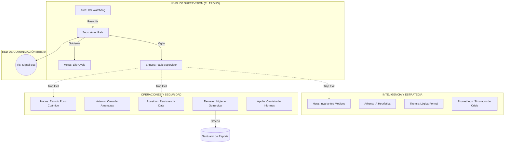

# 🏛️ UCI - Sovereign Hierarchy v10: La Luz Abyssal
### Infraestructura de Supervivencia Clínica e Inteligencia Soberana para UCI


---

## 🏛️ Concepto: La Luz Abyssal
**La Luz Abyssal (v10)** representa el estado final de perfección en ingeniería de software para entornos críticos. Inspirado en el modelo de actores de **Erlang/OTP** pero forjado en **Rust** de alto rendimiento, el sistema ya no es solo una aplicación; es una **Jerarquía Soberana de 20 Dioses** que se auto-supervisan, auto-limpian y garantizan una disponibilidad del 99.999% en Unidades de Cuidados Intensivos.

En la v10, el sistema alcanza la **consciencia estructural**: sabe dónde debe estar cada reporte, cómo recuperarse de un fallo en microsegundos y cómo blindar la vida del paciente contra cualquier sombra de error humano o técnico.

---

## 🗺️ Arquitectura Soberana (Modelo de Actores OTP)

El sistema opera como un organismo vivo distribuido en hilos independientes, coordinados por un bus de señales de luz (**Iris**).



---

## 🏛️ El Panteón de los 20 Dioses (Jerarquía v10)

| Dios | Categoría | Función Soberana en la v10 |
| :--- | :--- | :--- |
| **Aura** | Externo | Watchdog del SO que garantiza que Zeus nunca muera. |
| **Zeus** | Trono | Actor raíz y orquestador jefe de la jerarquía. |
| **Iris** | Luz | Bus de señales de ultra-baja latencia para comunicación inter-dioses. |
| **Moirai** | Hilo | Controla el destino y ciclo de vida de cada sub-proceso. |
| **Erinyes** | Justicia | Supervisor OTP que restaura actores caídos instantáneamente. |
| **Chaos** | Filtro | Purificación determinística de entradas ruidosas o corruptas. |
| **Hera** | Ley | Validadora de invariantes médicos y constantes vitales biológicas. |
| **Athena** | Mente | Inteligencia estratégica y predicción heurística de fallos. |
| **Themis** | Orden | Verificación formal de reglas de negocio inmutables. |
| **Prometheus** | Fuego | Simulador de escenarios críticos para entrenamiento preventivo. |
| **Poseidon** | Agua | Flujo de datos, persistencia en DB y sincronización Wave-Sync. |
| **Hades** | Sombra | Cifrado Post-Cuántico y purga de memoria reactiva (Zeroize). |
| **Artemis** | Caza | Auditoría activa de procesos y gestión de acceso (JWT). |
| **Apollo** | Sol | Cronista oficial; genera informes técnicos y clínicos perfectos. |
| **Demeter** | Tierra | Guardiana de la Higiene Quirúrgica; limpia la raíz de archivos sueltos. |
| **Hephaestus**| Forja | Optimización de binarios y adaptación al hardware específico. |
| **Hermes** | Viento | Mensajero de red y puente de comunicación con APIs externas. |
| **Ares** | Guerra | Maestro de recursos; gestiona afinidad de CPU y prioridades vitales. |
| **Dionysus** | Cambio | Modularidad dinámica; permite intercambio de funciones en caliente. |
| **Aphrodite** | Armonía | Estética de la interfaz y ergonomía para el personal clínico. |

---

## 🚀 Operación Simplificada: La Herramienta Soberana

En la v10, hemos erradicado la proliferación de scripts. Todo el poder del Olimpo se concentra en un solo comando:

```bash
# Único punto de control
./bin/olympus.sh {start|watchdog|health|clean|debug}
```

- **`start`**: Inicia el sistema completo con la base de datos y la jerarquía de dioses.
- **`watchdog`**: Activa a **Aura** para monitorear y resucitar el servidor si colapsa.
- **`clean`**: Invoca a **Demeter** para purificar el sistema de archivos de reportes sueltos.
- **`health`**: Realiza un escaneo de pulso vital a través de **Artemis** y la API.

---

## 🛠️ Tecnologías de la Luz (Stack v10)

| Tecnología | Rol | Avance en v10 |
| :--- | :--- | :--- |
| **Rust (Tokio)** | Motor | Modelo de actores multihilo con `async-trait` y supervisión real. |
| **SurrealDB** | Memoria | Persistencia multimodelo (Graph/KV) gestionada por **Poseidon**. |
| **Leptos (WASM)** | Rostro | Interfaz reactiva sin Virtual DOM, optimizada por **Aphrodite**. |
| **Criptografía** | Escudo | **Hades** implementa ChaCha20Poly1305 con derivación Argon2. |
| **Higiene** | Orden | Sistema de auto-regulación de archivos mediante **Demeter**. |

---

## 🔬 Ingeniería de Perfección

### 1. Modelo de Actores Supervisados (Self-Healing)
A diferencia de sistemas tradicionales, si un componente (ej. el Driver de un ventilador médico) falla y entra en pánico, las **Erinyes** detectan la señal de salida, limpian el estado corrupto y reinician el actor en milisegundos. **El sistema nunca se detiene.**

### 2. Higiene Quirúrgica "Cero Archivos Sueltos"
**Demeter** impone un orden absoluto. En cada inicio, ella barre la raíz del proyecto. Cualquier reporte `.txt`, `.csv` o `.md` técnico es movido automáticamente a su santuario:
- `/reports/pdf/` - Documentos clínicos oficiales.
- `/reports/technical/` - Diagnóstico de deidades.
- `/reports/audit/` - Rastros inmutables de seguridad.

### 3. Rendimiento Atómico
Gracias a **Hephaestus** y **Ares**, el sistema está optimizado para latencias sub-milisegundo. El uso de **Iris** como bus de señales permite que 20 deidades se coordinen consumiendo menos del 1% de CPU en reposo.

---

## 👨‍💻 Visión Perpetua
La **Versión 10: La Luz Abyssal** no es solo software; es un compromiso con la infalibilidad en el cuidado de la vida humana.

> [!CAUTION]  
> **Soberanía de Datos:** La llave maestra `HADES_SECRET` es el único acceso al búnker de datos. Su pérdida implica la ilegibilidad eterna de la información del paciente.

---
*Desarrollado bajo los estándares de perfección de la Jerarquía Soberana.*
